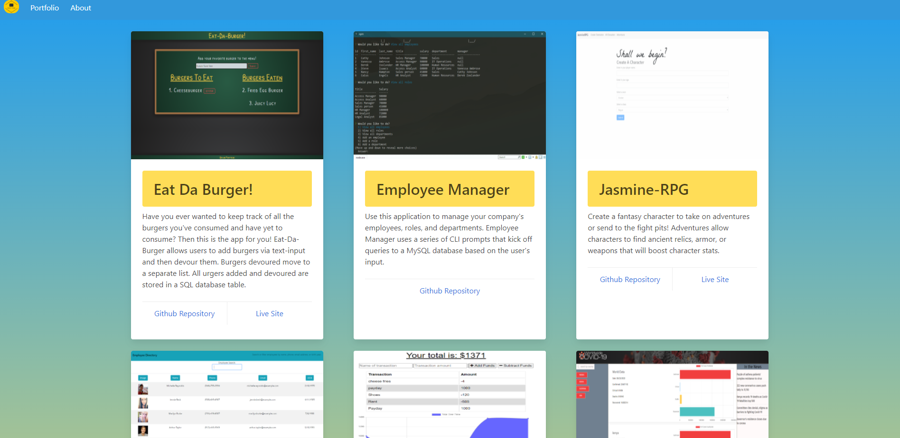
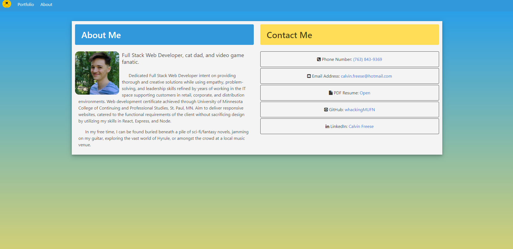

# React Portfolio

## Description
Portfolio built using React, React Router, and Bulma. 
    
* [Live Site](https://calvinfreese.github.io/my-react-portfolio/)

## Installation
#### Tehcnologies Used
* [Reactjs](https://reactjs.org/)
* [Bulma](https://bulma.io/)
* [GitHub Pages](https://pages.github.com/)
* [Visual Studio Code](https://code.visualstudio.com/)
* [cmder](https://cmder.net/)

#### Steps
1. * Start by entering the following in your terminal: `Git clone https://github.com/whackingMUFN/my-react-portfolio.git`

2. * Change directory to `my-react-portfolio` and enter `npm install` into your terminal. This will install all package dependencies.

3. * Add node_modules to .gitignore.

4. * Start the application by running `npm start`

## Screenshots

## Credits
This assignment is provided by Trilogy Education Services. Code was structured based on in class activities and lectures, [React Documentation](https://reactjs.org/docs/getting-started.htmlS) for React syntax, and [Bulma Block List](https://www.csrhymes.com/bulma-block-list/) - [Bulma Block List Github](https://github.com/chrisrhymes/bulma-block-list), and various other online resources. 

## License

[License](LICENSE)
MIT (c) 2020 Calvin Freese
